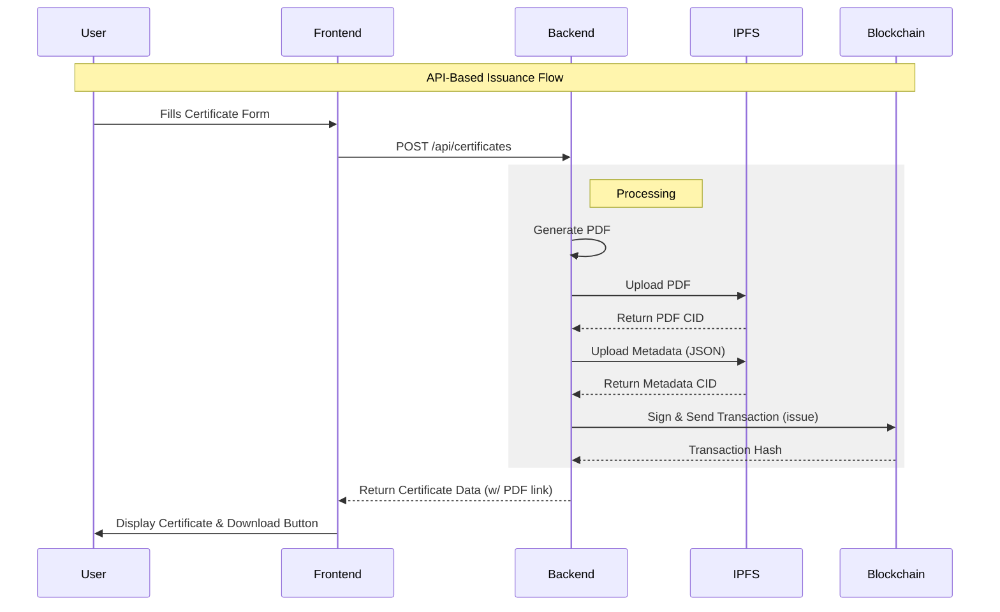

# 🏗️ Project Architecture & Flow

This document outlines the workflows and architecture of your **Blockchain Certification System**. Your project implements a **Hybrid Architecture** that supports both centralized API-based issuance and decentralized wallet-based interaction.

---

## 🧩 Core Components

1.  **Frontend (Next.js)**
    - **User Interface**: Dashboard for viewing, creating, and verifying certificates.
    - **Wallet Connection**: Uses `RainbowKit` & `Wagmi` to connect user wallets (MetaMask) for direct blockchain interaction.
    - **API Client**: Consumes the Laravel backend for "gasless" operations.

2.  **Backend (Laravel API)**
    - **Orchestrator**: Manages the data pipeline.
    - **PDF Generator**: Creates professional PDF certificates on the fly.
    - **IPFS Handler**: Uploads files/metadata to Decentralized Storage (Pinata) or simulates it locally.
    - **Blockchain Service**: Acts as a "Relayer", signing transactions with a server-side private key so users don't have to pay gas.

3.  **Blockchain (Hardhat/Local)**
    - **Cert.sol**: Smart contract storing the "Truth" (Who owns what CID).
    - **CertNFT.sol**: NFT version of the certificates.

4.  **Storage layer**
    - **IPFS (Pinata)**: Production-grade decentralized file storage.
    - **Local Mock**: Development storage for testing without API keys.

---

## 🔄 Workflow 1: API-Based Issuance (The "Easy" Mode)
*This is the flow you just tested with the Form and PDF download.*

**Goal**: Issue a certificate without the user needing a crypto wallet or gas.

1.  **Submission**: Admin fills the form on the Frontend (Name, Email, Title).
2.  **Request**: Frontend sends `POST` request to `http://localhost:8000/api/certificates`.
3.  **Backend Processing**:
    - **Step A (PDF)**: Laravel generates a PDF file using the `dompdf` library.
    - **Step B (Upload)**: Laravel uploads the PDF to IPFS (or `mock_ipfs`). Returns a CID (e.g., `bafy...`).
    - **Step C (Metadata)**: Laravel creates a JSON metadata file complying with NFT standards and uploads that to IPFS too.
    - **Step D (Blockchain)**: Laravel uses its configured **Private Key** (in `.env`) to sign a transaction calling `issue(recipient, metadata_cid)` on the Smart Contract.
4.  **Result**: The certificate is live. The Frontend receives the full object, including the IPFS links and Transaction Hash.

---

## 🔄 Workflow 2: DApp-Based Issuance (The "Crypto" Mode)
*This flow is handled by `AdminPanel.tsx` / `CertClient.tsx`.*

**Goal**: Issue a certificate directly from your wallet (MetaMask).

1.  **Connection**: Admin connects their wallet using the "Connect Wallet" button.
2.  **Interaction**: Admin enters the Recipient Address and the IPFS CID (which they must have updated previously).
3.  **Transaction**: The Frontend (Wagmi) requests the **User's Wallet** to sign the transaction.
4.  **Gas Payment**: The connected user pays the gas fees.
5.  **Confirmation**: The transaction is mined, and the certificate is issued.

---

## 🔎 Verification Flow

How does someone prove the certificate is real?

1.  **Input**: User provides a Transaction Hash or Certificate ID.
2.  **Blockchain Check**: The system queries the Smart Contract: "Does this ID exist? Who owns it?"
3.  **Integrity Check**: The system fetches the Metadata from IPFS using the CID stored on-chain.
4.  **Match**: If the Blockchain data matches the Metadata, the certificate is **Authentic**.

---

## 📊 Data Flow Diagram

