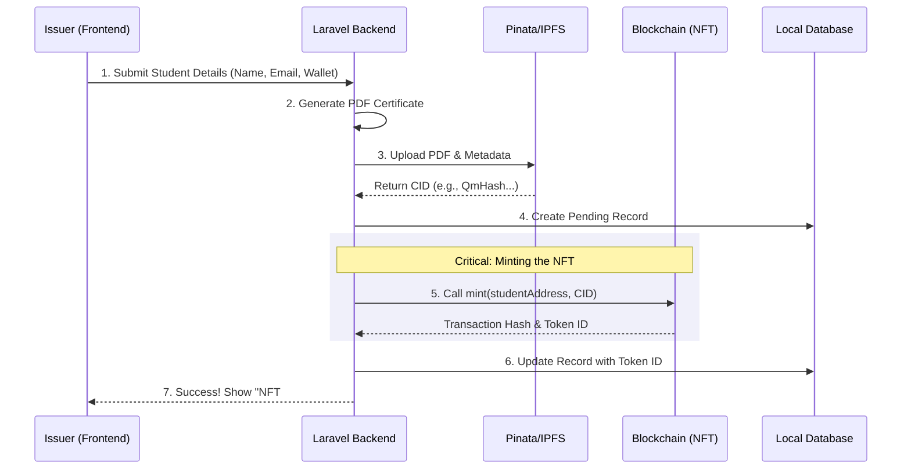

# Project Vision & Flow: CertNFT Platform

## 1. Vision Statement
To establish a decentralized, tamper-proof academic credentialing system that empowers educational institutions (Admin, NSS, IEDC) to issue verifiable digital certificates as NFTs. This system eliminates certificate fraud, ensures permanent access via IPFS, and provides instant global verification for students and employers.

## 2. Core Architecture
The project operates on a **Hybrid Architecture** combining the speed of Web2 with the trust of Web3.

- **Frontend (Next.js)**: User interface for Issuers (Admin Console) and Verifiers (Public Page). Connects to Blockchain via Wallet (Wagmi/Viem).
- **Backend (Laravel)**: Manages student data, generates PDF certificates, handles IPFS uploads, and acts as the "Oracle" to trigger blockchain minting.
- **Blockchain (Ethereum/Hardhat)**: Stores the "Single Source of Truth". The `CertificateNFT` smart contract maps `TokenID -> Owner -> IPFS_CID`.
- **Storage (IPFS/Pinata)**: Decentralized storage for the actual PDF assets and metadata JSON, ensuring documents last forever even if the server goes down.

## 3. User Roles & Permissions

| Role | Responsibility | Access Level |
|------|----------------|--------------|
| **Super Admin (College)** | deploy contracts, manage other issuers, issue main degree certs. | `DEFAULT_ADMIN_ROLE` |
| **NSS Officer** | Issue NSS activity certificates. | `ISSUER_ROLE` |
| **IEDC Officer** | Issue innovation/startup certificates. | `ISSUER_ROLE` |
| **Student** | Receive NFTs, download PDFs, share verification links. | Read-Only / Owner |
| **Verifier** | Verify authenticity of any certificate ID. | Public Access |

---

## 4. End-to-End Project Flow

### A. The Issuance Flow (Issuer Journey)
This is the primary action where a certificate is born.



### B. The Verification Flow (Public Journey)
Anyone with the Token ID can verify the truth.

```mermaid
graph LR
    User[Verifier] -->|Enter Token ID| UI[Verify Page]
    UI -->|1. ownerOf(id)| Contract[Smart Contract]
    UI -->|2. tokenURI(id)| Contract
    
    Contract -- "0x123... (Owner)" --> UI
    Contract -- "ipfs://Qm..." --> UI
    
    UI -->|3. Fetch JSON| IPFS[IPFS Gateway]
    IPFS -- "Title, Date, PDF Link" --> UI
    
    UI -->|Display| Result[Verified Badge & PDF Download]
```

### C. The Student Portfolio Flow
How a student views their earned credentials.

1. **Connect Wallet**: Student connects their MetaMask/Rainbow wallet.
2. **Auto-Discovery**: The frontend queries the contract for all `BalanceOf(User)`.
3. **Gallery View**: Displays all owned certificates as cards.
4. **Action**: Student can download the PDF or copy the verification link to LinkedIn.

---

## 5. Technical Data Lifecycle

1. **Input**: `Form Data` (Name, Course, etc.)
2. **Processing**: PHP converts this to a PDF file.
3. **Storage**: PDF + JSON Metadata -> Uploaded to IPFS.
4. **Minting**: The `CID` (Content Identifier) is permanently written to the Smart Contract.
5. **Indexing**: The Backend stores the `Transaction Hash` and `Token ID` for fast searching/display, but the **Blockchain is the authority**.

## 6. Future Roadmap (The "Vision")
1. **Multi-Institution Support**: Allow other colleges to join the same ecosystem.
2. **Soulbound Tokens (SBTs)**: Make certificates non-transferable (students shouldn't be able to sell their degrees!).
3. **Revocation Dashboard**: Allowing Admin to revoke certificates (e.g., if issued in error) using the `revoke()` contract function.
4. **LinkedIn Integration**: One-click "Add to Profile" using the verify URL.
